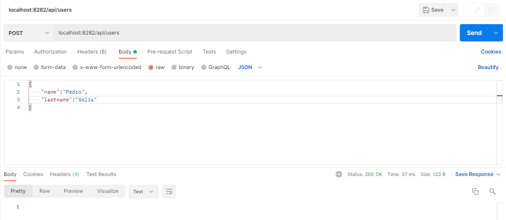
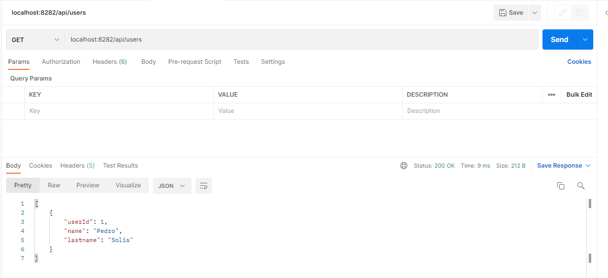
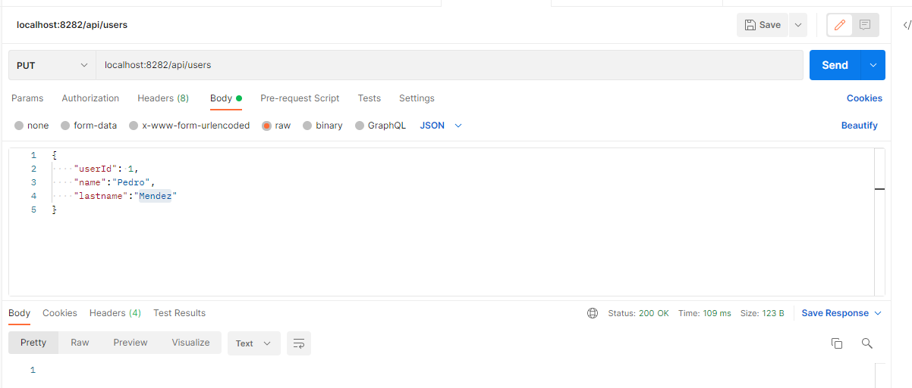
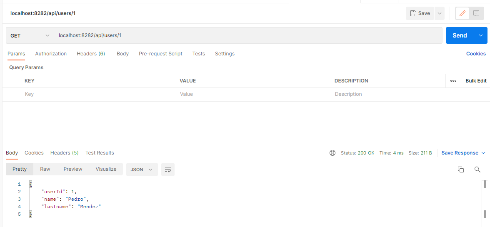
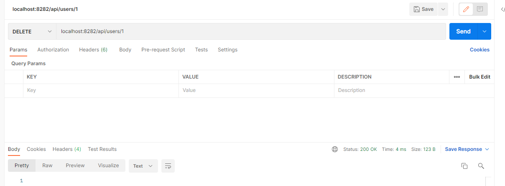
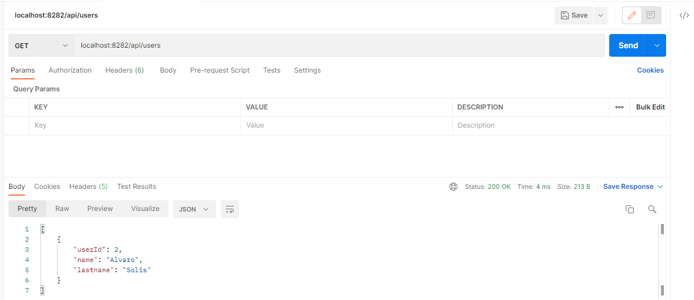

# First Rest Service with Spring Boot


[](https://travis-ci.org/joemccann/dillinger)

Basic example rest service building with:
- [Spring Boot](https://spring.io/)


## Run
Using [Java 11+](https://jdk.java.net/11/)
```sh
mvn spring-boot:run
```
## Configuration
The following default properties are used in the application:
```sh
server.port=8282
```

## Usage

All available application endpoints are test using postman.






